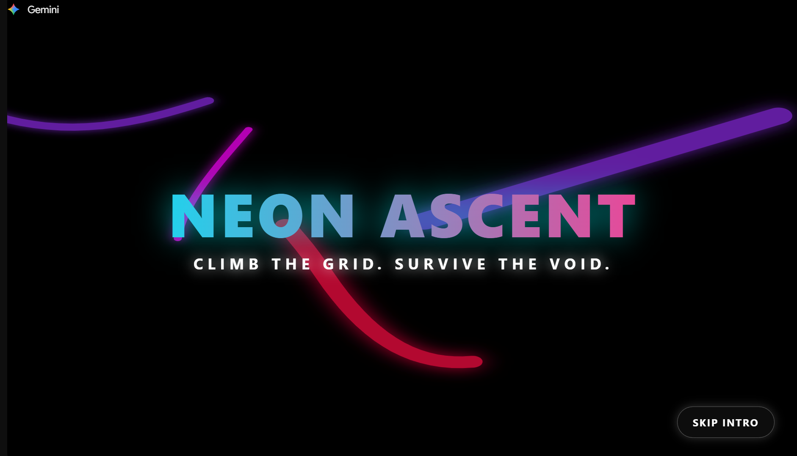
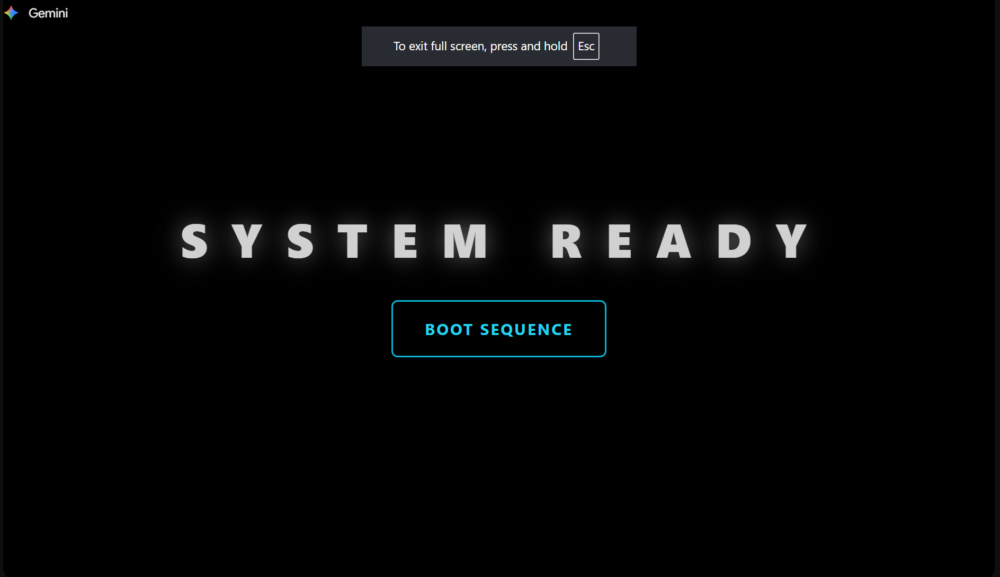
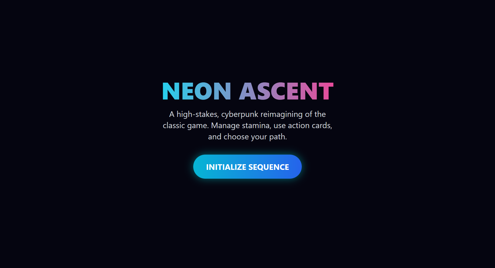
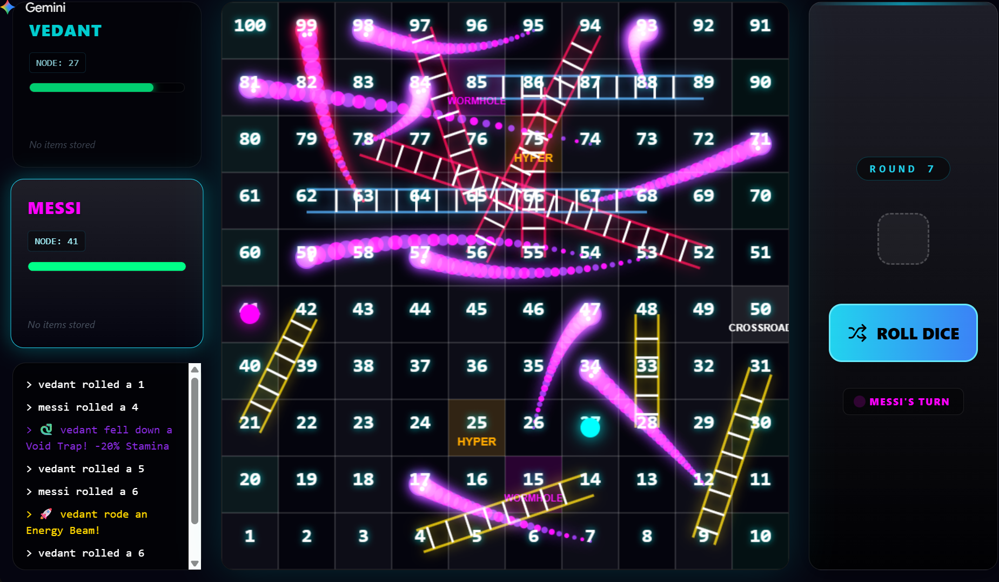
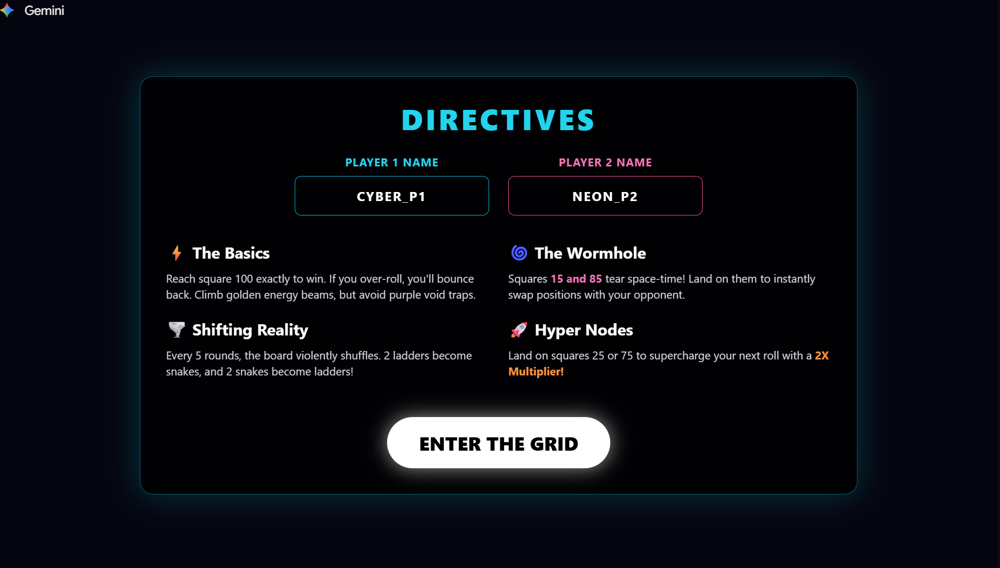

# Google-Gemini-GameNight-Winner
🏆 Winning game built during the Gemini Canvas Game Night Competition using AI-assisted development, creative gameplay mechanics, and interactive design.

# 🏆 NEON ASCENT

### Climb the Grid. Survive the Void.

Winner of the Gemini Canvas Game Night Competition 2026

---

## 🎮 Overview

Neon Ascent is a cyberpunk-inspired board game built during the Gemini Canvas Game Night Competition.

Inspired by the classic Snakes and Ladders formula, players race through a futuristic digital grid filled with energy beams, void traps, wormholes, and reality-shifting events. The objective is simple: be the first player to reach Square 100.

What makes Neon Ascent unique is its dynamic board system. The game world continuously evolves, forcing players to adapt their strategies as ladders and snakes change throughout the match.

---

## 🏅 Competition Achievement

🏆 **1st Place Winner – Gemini Canvas Game Night Competition 2026**

Developed during a solo game-building challenge using Google Gemini Canvas.

Judging Criteria:

* Playability
* Creativity
* Completeness
* Fun Factor

---

## 🎯 Objective

Reach Square 100 exactly before your opponent.

If a player rolls a number that exceeds Square 100, the character bounces back by the remaining spaces.

---

## ⚡ Core Features

### 🌉 Energy Beams

Golden energy beams act as ladders.

Landing on the base of an energy beam instantly launches the player to a higher square, helping them progress faster through the grid.

---

### 🕳️ Void Traps

Purple void traps act as snakes.

Landing on a trap sends the player backward, slowing their ascent toward the Mainframe Core.

---

### 🌀 Wormholes

Special wormholes exist on:

* Square 15
* Square 85

Landing on either wormhole instantly swaps positions with the opposing player, creating unexpected comebacks and strategic twists.

---

### 🚀 Hyper Nodes

Hyper Nodes are located on:

* Square 25
* Square 75

Landing on a Hyper Node supercharges the player's next dice roll with a **2× multiplier**, allowing for massive jumps across the board.

---

### 🌪️ Shifting Reality

The digital grid is unstable.

Every 5 rounds, a Board Shuffle event occurs:

* 2 ladders become snakes
* 2 snakes become ladders

This constantly changes the game environment and ensures that no two matches play exactly the same way.

---

## 🎨 Visual Style

Neon Ascent embraces a cyberpunk aesthetic featuring:

* Neon cyan highlights
* Purple void effects
* Futuristic digital grid design
* Animated gameplay elements
* Dark sci-fi inspired interface

Color Theme:

* Background: #050510
* Neon Cyan
* Electric Purple
* Golden Energy Effects

---

## 🛠 Built With

* Google Gemini Canvas
* HTML5
* CSS3
* JavaScript

---

## 📸 Screenshots

### 🎮 Game Introduction

### 🚀 Boot Screen

### 🎯 Game Initialization / Gameplay Start

### 🧠 Game Board

### 📜 Game Directives / Rules

---

## 🚀 How to Play

1. Enter player names.
2. Roll the dice on your turn.
3. Use Energy Beams to climb faster.
4. Avoid Void Traps.
5. Take advantage of Hyper Nodes.
6. Use Wormholes strategically.
7. Adapt to the Shifting Reality events.
8. Reach Square 100 exactly to win.

---

